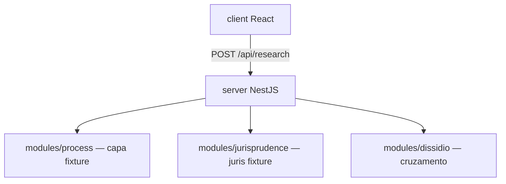

# Arquitetura (React + Nest)

O `server/` segue o DNA do Buglan:

- `src/common` — filters, pipes, middlewares, decorators
- `src/config` — pasta reservada (banco fica para depois)
- `src/models` — tipos do processo, jurisprudência e pesquisa
- `src/modules/<nome>` — `module`, `controller`, `service`, `dto`
- aliases: `@common/*`, `@config/*`, `@models/*`, `@plugins/*`, `@modules/*`
- prefixo HTTP `api`, porta `APP_PORT` ou 3000

## Módulos da demo

1. `research` — orquestra o POST `/api/research`
2. `process` — capa no formato DataJud (fixture)
3. `jurisprudence` — ementas/votos (fixture)
4. `dissidio` — compara câmaras + chance/blindagem

`ResearchService`: processo → jurisprudência → dissídio → um payload.

## Princípios

- Nest **orquestra**; não carrega bilhões de linhas
- DataJud depois = consulta de capa/andamento, não dump
- Sem ementa na fonte → `citeStatus: unavailable`
- Demo só com partes fictícias

## Pastas

- `client/` — React + Vite
- `server/` — NestJS
- `docs/` — produto, fluxo, arquitetura
- `server/src/fixtures/` — processo bancário e jurisprudências da demo
