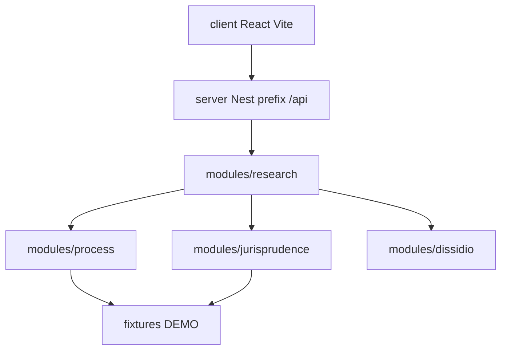

# Arquitetura (React + Nest) — molde buglan

Espelha a organização do Nest em [joaozupeli/buglan](https://github.com/joaozupeli/buglan): `client/` + `server/`, com aliases `@common`, `@config`, `@modules`, `@models`, `@plugins`.



## Layout do servidor (como o buglan)

```text
server/src/
  main.ts                 # helmet, prefix api, cors, ValidationPipe, HttpExceptionFilter
  app.module.ts
  common/                 # filters, pipes, middlewares, decorators, guards
  config/                 # database/auth configs (demo pode stubar)
  models/                 # sequelize models (opcional na demo)
  modules/
    research/
    process/
    jurisprudence/
    dissidio/
  fixtures/               # JSON fictício (não é dump DataJud)
```

Cada módulo: `*.module.ts` + `*.controller.ts` + `*.service.ts` + `*.dto.ts`.

## Princípios

- Nest **orquestra**; não carrega 1,2 bi em memória
- Demo = fixtures; produção = adapter DataJud (capa/andamento) + ementa oficial
- Assertividade: votos/câmaras + dissídio + cite-or-silent
- Front é **React** (buglan usa Vue no `client/`; aqui trocamos só o client)

## Root scripts (como o buglan)

- `pnpm dev` → client
- `pnpm dev:server` → Nest `start:dev`
