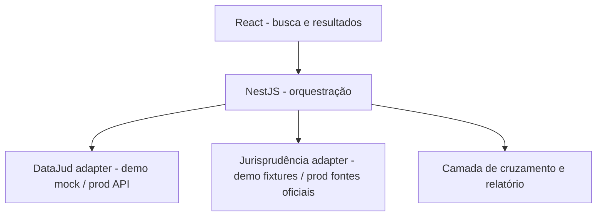

# Arquitetura (React + Nest)

## Princípios
- Nest **orquestra**; não tenta carregar 1,2 bi em memória
- DataJud sob demanda (consulta), não dump
- Assertividade: fonte oficial + comparação de câmaras + cite-or-silent
- Dados do cliente: demo só fictício; produção: minimização / gate LGPD no roadmap

## Pastas sugeridas (demo)
- `frontend/` — React + Vite
- `backend/` — NestJS
- `docs/` — produto, fluxo, arquitetura, prompt demo
- `backend/src/fixtures/` — processos e juris de demonstração
