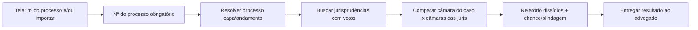

# Fluxo do usuário (OpenLegalAI)

## 1. Entrada
Duas opções na mesma tela:
1. **Colar número do processo** (padrão CNJ)
2. **Importar documento(s)** — ainda assim o **número do processo é obrigatório**

## 2. Resolução do processo
Backend busca metadados do processo. Caminho ao vivo: API pública DataJud (`/api/datajud/*` e tools MCP `abrir_datajud` / `buscar_datajud` / `comparar_datajud`). Caminho fixture: `POST /api/research` (`demo: true`). DataJud devolve capa e andamentos, não ementa.

Extrai / registra:
- tribunal, classe, assuntos
- **câmara/órgão** do caso (quando disponível)
- tese jurídica resumida (demo: derivada do fixture)

## 3. Jurisprudências
Busca juris relacionadas à tese.
Cada item deve trazer, quando possível:
- tribunal / câmara / turma
- ementa (ou snippet)
- **voto** / resultado (acolhe, rejeita, etc.)

## 4. Dissídios
Compara:
- votos / orientação da **câmara do processo do advogado**
- votos / orientação das **câmaras das jurisprudências** encontradas

Classifica alinhamento: a favor | contra | diverge | desconhecido.

## 5. Relatório final
Entrega ao advogado:
- lista de juris com votos
- mapa de **dissídios** entre câmaras
- **chance** heurística
- **blindagem**: pontos que a contraparte pode usar a partir de votos divergentes
