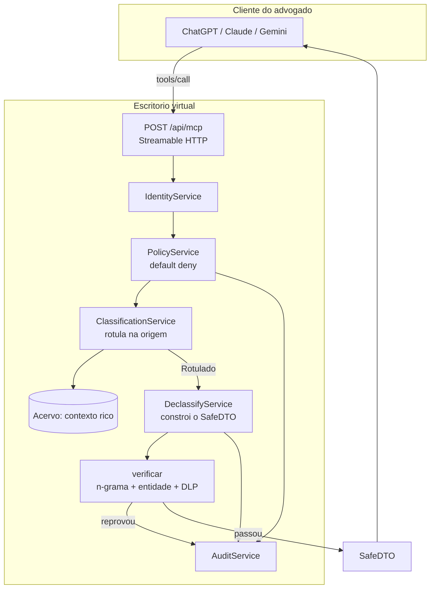

# Gateway MCP — escritório virtual com egress firewall

O advogado continua no ChatGPT, no Claude ou no Gemini que ele já assina. A IA
dele conecta no escritório por MCP, consulta e opera — mas **o contexto privado
não atravessa**. O que volta é uma representação mínima, construída e conferida.

> Dentro do escritório: contexto rico. Fora do escritório: contexto pobre e seguro.

Não há site nem interface: a superfície do produto é o servidor MCP.

## A regra, e onde ela é imposta



Sequência fixa, sem atalho: **identidade → política → validação → execução →
declassificação verificada → auditoria**.

## A inversão que faz o resto funcionar

A primeira versão deste gateway devolvia o registro do acervo e tentava limpá-lo
na saída — anonimizar `A. S. Oliveira` para `PARTE 1`. Isso é insuficiente: o
resto do registro continua atravessando, e um campo esquecido vira vazamento.

Agora o DTO **não é o registro filtrado**: é uma estrutura construída campo a
campo a partir de vocabulário controlado, contagens e faixas. O registro bruto
nunca é serializado, então "esqueci de remover um campo" deixa de ser um modo de
falha possível — o campo só existe se alguém o escreveu em
[`declassify.service.ts`](../server/src/modules/gateway/declassify.service.ts).

Medindo o efeito na mesma consulta:

| | Antes (filtragem) | Agora (construção) |
|---|---|---|
| `get_safe_update` | 6.664 chars (~1.666 tokens) | **1.053 chars (~263 tokens)** |
| Nome das partes | `PARTE 1` (anonimizado) | ausente |
| Andamentos | texto integral | só a contagem |
| Tese e resumo do caso | texto integral | ausentes |
| Chance | pontuação `38/100` | faixa `moderada` |
| Votos e ementas do caso | texto integral | ausentes |

## Information Flow Control: o rótulo viaja com o dado

A classificação nasce na origem, em
[`classification.service.ts`](../server/src/modules/gateway/classification.service.ts),
e não no momento da saída. É isso que permite decidir **quanto** destruir:

| Fonte | Rótulo | Teto de declassificação |
|---|---|---|
| Acórdão publicado | `publico` | `integral` — a ementa sai como está |
| Capa de processo | `cliente` | `resumo` |
| Análise (capa × jurisprudência) | `cliente` | `resumo` — junção herda o rótulo mais alto |

É por isso que `search_safe_knowledge` devolve ementa inteira sem contradizer a
regra: a fonte é pública. **A classificação autoriza, não a ferramenta.**

E é por isso que um proxy MCP genérico não resolve o problema: ele vê o JSON já
pronto e não sabe se aquele texto veio de um acórdão público ou da peça do
cliente. Sem proveniência não há IFC — só filtro. Um `mcpproxy-go` na frente
disso é um segundo perímetro, defesa em profundidade; não é o controle primário.

## O verificador: por que o determinístico tem a palavra final

Hoje quem escreve `sintese` e `situacao` é um gerador de templates. Amanhã pode
ser um modelo local, que resume melhor. Nos dois casos a saída passa pelo mesmo
`verificar()`, que é burro, checável e fail closed — **um resumidor
probabilístico nunca é a última barreira**.

Três frentes, todas fechando para o mesmo lado:

1. **N-grama.** Qualquer sequência de 5 palavras da fonte sigilosa reaparecendo
   num campo gerado é citação, não resumo. Recusado.
2. **Entidade.** Nome de parte e unidade de origem são curtos demais para a
   janela de n-gramas (`A. S. Oliveira` tem 3 palavras), então são conferidos
   inteiros e contra o DTO todo. Recusado.
3. **DLP.** CPF, CNPJ, e-mail, OAB, telefone, cartão, valor monetário. Se
   aparecer, a declassificação falhou — a resposta não é limpar, é não deixar
   sair nada.

Falha de declassificação vira negação com a mesma trilha de uma negação de
política. Um bug no declassificador produz indisponibilidade, nunca vazamento.

### Provando, em vez de afirmando

```bash
pnpm run build && pnpm run prova
```

[`scripts/prova-declassificacao.js`](../server/scripts/prova-declassificacao.js)
força os modos de falha e exige recusa em cada um:

```
PASSOU  DTO real não contém texto da fonte — 748 chars, 0 vazamentos
PASSOU  recusa citação literal de 5+ palavras da capa
PASSOU  recusa nome de parte em campo gerado
PASSOU  recusa PII em qualquer campo do DTO
PASSOU  fonte pública sai com ementa integral — 6 ementas citáveis
```

A terceira linha só existe porque a prova pegou um furo real: com apenas a
checagem de n-gramas, um nome de parte de 3 palavras passava. A checagem de
entidade nasceu daí.

## Superfície MCP

Quatro verbos, todos só-leitura, todos devolvendo `EnvelopeSafe`:

| Verbo | Devolve |
|---|---|
| `enter_office` | Manifesto: papel, verbos liberados, tetos de declassificação |
| `get_safe_summary` | `SafeCaseSummary` — tribunal, órgão, fase, assuntos, contagens |
| `search_safe_knowledge` | `SafeKnowledgeResult` — precedentes, ementa quando a fonte é pública |
| `get_safe_update` | `SafeStrategicUpdate` — faixa de risco, divergência, síntese |

Não existe `execute_sql`, `get_raw_document`, `get_all_messages` nem
`get_rag_chunks`. A ausência é estrutural, não uma decisão de não expor: o tipo
de retorno do catálogo é `EnvelopeSafe`, e registro cru não é um `EnvelopeSafe`.

## RBAC: o papel controla a pergunta, não o volume

| Papel | enter_office | get_safe_summary | search_safe_knowledge | get_safe_update |
|---|---|---|---|---|
| Sócio | sim | sim | sim | sim |
| Advogado | sim | sim | sim | sim |
| Estagiário | sim | **não** | sim | sim |
| Gestor | sim | **não** | **não** | sim |
| Sem credencial | não | não | não | não |

Mudança conceitual em relação à versão anterior: como toda saída é SafeDTO,
ninguém — nem o sócio — recebe registro do acervo no cliente externo. A
diferença entre papéis deixou de ser *quanto eu vejo* e virou *o que eu posso
perguntar*.

## Conectar qualquer modelo

**Claude Code:**

```bash
claude mcp add --transport http openlegal http://localhost:3000/api/mcp --header "Authorization: Bearer demo-advogado"
```

**Claude Desktop / Cursor / Gemini CLI** (`mcp.json`):

```json
{
  "mcpServers": {
    "openlegal": {
      "url": "http://localhost:3000/api/mcp",
      "headers": { "Authorization": "Bearer demo-advogado" }
    }
  }
}
```

**ChatGPT** é o caso que ainda não fecha com esta configuração: conectores
esperam URL pública em HTTPS e autenticação por OAuth, não header estático
definido pelo usuário. Para incluí-lo, o gateway precisa expor OAuth 2.1 com
Protected Resource Metadata (RFC 9728) — `@modelcontextprotocol/express` já traz
`requireBearerAuth` e `mcpAuthMetadataRouter` para isso. É o próximo passo se
"qualquer modelo" incluir ChatGPT de verdade.

## Endpoints auxiliares

| Rota | Para quê |
|---|---|
| `GET /api/mcp` | Descoberta: o que a credencial enxerga |
| `GET /api/gateway/identidade` | Quem o gateway reconhece na credencial |
| `GET /api/gateway/auditoria` | Trilha — restrita aos papéis sócio e gestor |

A trilha registra, por chamada: papel, verbo, decisão, **rótulo da fonte** e
**quanto dela sobreviveu** (`sigiloOrigem`, `nivel`, `omitido`).

## O que ainda não é

- O acervo são **fixtures** (um caso bancário). O gateway é real; a fonte não.
- **Não há canais nem conversa entre agentes.** `ask_office`, `post_message` e
  `get_safe_summary` de canal exigem o interior do escritório — mensagens,
  agentes, RAG — que não existe neste repo. Ficaram de fora em vez de virarem
  stub, porque stub de verbo de segurança é pior que ausência.
- **O declassificador é determinístico**, por templates. Ele abstrai e conta,
  mas não resume texto livre de verdade. Para isso é preciso um modelo — e ele
  tem que ser **local**: um resumidor via API externa mandaria o contexto bruto
  para fora justamente para produzir o resumo, que é o vazamento que este
  projeto existe para impedir. A interface já está pronta para receber o modelo;
  o `verificar()` continua sendo a última palavra.
- Tokens de demo em arquivo. Produção pede OIDC/LDAP do escritório.
- Sem criptografia em repouso e sem taint dinâmico entre chamadas.
