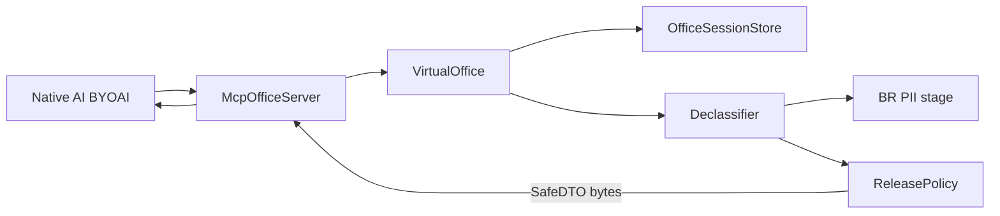
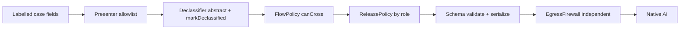

# Architecture v3 — SafeDTO / Declassification (approved direction)

Status: **implemented force-total on `enzo`**. Codex FAIL on v2 thesis accepted.

## Thesis

Private virtual office reachable via MCP (BYOAI). Raw context never returns to the native AI UI. Tool outputs **are** SafeDTO. Thin-C redaction is an internal DLP stage only.

## Egress product

```ts
type SafeDTO = {
  schemaVersion: '1';
  sessionId: string; // ofs_*
  releaseId: string; // rel_*
  summary: string;   // max 600
  decisions: SafeItem[];
  tasks: SafeTask[];
  safeReferences: SafeRef[];
  warnings: SafeWarning[];
};
```

## Flow



## Codex P0/P1 mapping

| Finding | Fix |
|---|---|
| redaction ≠ declassification | `Declassifier` builds abstract SafeDTO |
| no MCP boundary | `McpOfficeServer` + allowlist + byte spy |
| free-text answer bypass | no `GatewayResult.answer`; only SafeDTO |
| injection in demo | warning + ignored; no dump in bytes |
| RBAC enter-only | `ReleasePolicy` thins SafeDTO by role |
| spy only on provider in | spy on MCP serialized bytes |

## Session principal freeze

`enter_office` freezes the effective principal. Later tools read `session.role`, never the
call argument. A mismatch denies with the internal reason `SESSION_PRINCIPAL_MISMATCH` and
the caller receives the fixed public error. This closes intra-session role escalation.

## Information Flow Control

Egress is now four ordered layers instead of one redaction pass. Each layer fails closed.

### Layer 1. Classification labels

`Classification` is `PUBLIC | INTERNAL | CONFIDENTIAL | STRICT`, ranked in a lookup table.
Case documents carry a label and every field carries its own label. The effective label of a
field is the maximum of the document label and the field label. A missing label resolves to
`STRICT`, so an unlabelled field can never cross by accident.

`FlowPolicy` decides what may cross the MCP boundary. Only `PUBLIC` crosses in natura.
`INTERNAL`, `CONFIDENTIAL` and `STRICT` cross only when carrying an explicit declassification
flag. Denial returns the internal code `FLOW_DENIED_UNDECLASSIFIED`.

### Layer 2. Taint and provenance

Every candidate piece of a release is a `Tainted<T>` carrying `derivedFrom` and
`declassified`. `deriveTaint` takes the maximum label of the sources, and an empty source list
resolves to `STRICT`. The `declassified` flag is set only by the `Declassifier` when it emits
an abstract statement. It is never inferred from the label.

Taint is internal. Labels and provenance are never serialized into the bytes that reach the
external agent, and the final firewall treats their appearance as a leak.

### Layer 3. Typed presenter

`Presenter` is the only reader of case fields and it holds an explicit allowlist of field
names. A field outside the allowlist is never copied into memory, so it cannot reach a DTO
through a later mistake. The cut happens by construction before serialization. Regex and the
Brazilian PII scanner still run, but as the last internal check rather than the mechanism.

### Layer 4. Independent final firewall

`EgressFirewall` lives outside the DTO construction code and owns its own canary list plus
Brazilian patterns for CPF, CNPJ, OAB registration and CNJ process number. It runs after
serialization and before the result returns to the MCP caller. A hit yields a stable code such
as `FIREWALL_CANARY`, `FIREWALL_BR_PATTERN` or `FIREWALL_LABEL_LEAK`. The matched literal is
never placed in the code, the audit entry, or any thrown message. Because the firewall does
not share code with the declassifier, a bug in one cannot disable the other.



## Conceptual credit, not dependencies

These projects informed the design. None is a dependency here.

| Project | Idea borrowed | Why not a dependency |
|---|---|---|
| `microsoft/fides-gateway` | Classification labels attached to data, enforced at the boundary | We need labels per legal field and a Portuguese declassifier, and we avoid adopting an external policy runtime for a hackathon slice |
| `vinkius-labs/mcpfusion` | Typed egress with a late cut of undeclared fields | Our contract is one frozen DTO, so an allowlist presenter in our own types is smaller than adopting their framework |
| `mansoor-mamnoon/LLMFirewall` | Taint tracking on derived values | Our taint is three fields on an internal type, not a runtime to install |
| `behrensd/mcpwall` | A final firewall independent of the producer | License shows as NOASSERTION and maturity is unproven, so we reimplemented the pattern in a few dozen lines we can audit |

Out of scope for this slice: installing any of the above, real MCP transport, OAuth,
multi-tenant isolation.

## Evidence

`npm run evidence` runs typecheck, tests and the demo. The demo prints a SafeDTO without
name, CPF, account or process literals. Mutation checks confirm the tests are load-bearing.
Disabling `FlowPolicy`, `EgressFirewall`, or widening the presenter allowlist each turns tests
red.

These are technical controls. They are not a statement of legal compliance, and a DPO review
is still required.
