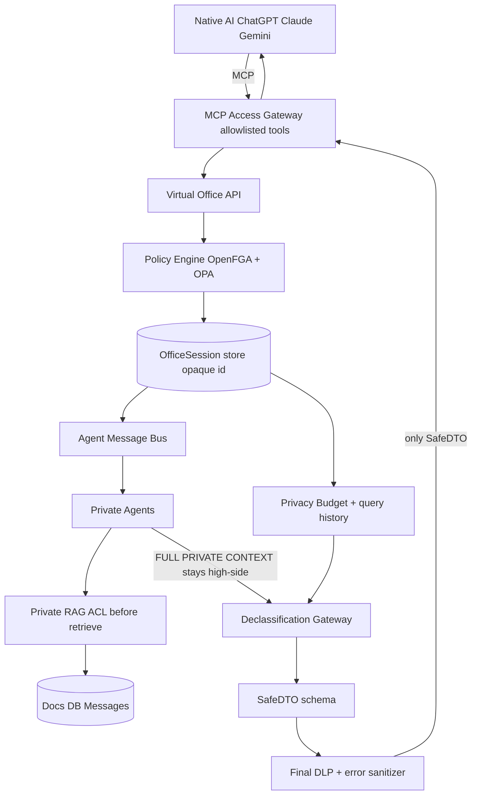

# Virtual Law Office — Architecture research (Phase 1)

Date: 2026-09-12.
Builds on: `docs/architecture/privacy-gateway-v3.md` (implemented slice) and `docs/research/fase1-*.md`.
Thesis: egress must **destroy information** (declassification), not only redact tokens.

## Implemented on `enzo` (this slice)

The `privacy-gateway/` package is product code. It is not a research sketch.

- Office session with opaque `ofs_*` ids.
- Allowlisted tools that return SafeDTO only.
- Connection principal from env/handshake. Tool arguments cannot set `user` or `role`.
- Declassifier templates, taint, presenter allowlist, independent egress firewall.
- MCP stdio adapter (`npm run mcp`) proven with Inspector CLI `tools/list` + `tools/call enter_office`, and with `npm run mcp:smoke` for `get_safe_summary`.
- Deterministic BR PII as an internal DLP stage.

## Architecture future (not implemented here)

Keep these out of the demo claim.

- OpenFGA / OPA as the authorization or egress policy runtime.
- Private RAG, private agents, and a high-side message bus.
- Multi-tenant isolation and OAuth / hosted HTTPS.
- Formal privacy budget against reconstruction by repeated safe queries.
- Presidio NER sidecar. The unused client was removed. Notes stay in `docs/research/fase1-privacy-security.md`.
- Ollama or any local model runtime.

## 1. Precise understanding

The lawyer stays in ChatGPT / Claude / Gemini. Those apps connect to Virtual Law Office via MCP (or API).

Two cognitive states for the external AI:

| State | What it knows |
|---|---|
| Outside | Native chat + public info + user-typed text + previously released SafeDTOs |
| Inside (OfficeSession) | Opaque session id only. Rich work happens **server-side** with private agents, RAG, channels, docs |

External AI may: enter/leave office, ask work, post messages, call private agents, request safe summaries.

External AI must never receive: raw messages, raw docs, RAG chunks, DB rows, credentials, full agent memory, or a near-lossless paraphrase of them.

The boundary is a **Declassification Gateway** (cross-domain export guard): summarize → abstract → aggregate → redact → suppress → classify → schema-validate → DLP → SafeDTO.

If the provider already saw the secret, the boundary failed. Prompts that say “forget” do not count.

## 2. What is technically possible

- Server-side OfficeSession with opaque id (`ofs_…`).
- Allowlisted MCP tools that only return SafeDTO or ack codes.
- Intercept tool **results** before they enter the external agent context (MCP proxy pattern).
- Private agents + private RAG that never share sockets with the external model.
- Classification labels + fail-closed policy (OPA/OpenFGA).
- Deterministic DLP + schema validation on outbound DTO.
- Local LLM (Ollama/vLLM) for summarization/declassification **inside** the high side.
- Privacy budget / rate limits / query-history gates against multi-query reconstruction (engineering approx. of composition).
- Protocol break: external MCP never holds DB/vector clients.

## 3. What is NOT technically possible (honest limits)

- Mathematical guarantee that no sequence of SafeDTOs reconstructs a person, without a formal privacy budget (DP-style) and often without destroying utility. Inferred from Dinur–Nissim / DP composition literature ([reconstruction theory](https://differentialprivacy.org/reconstruction-theory/), [composition](https://differentialprivacy.org/privacy-composition/)).
- Stopping a human who pastes secrets into the native chat (out of band).
- Fully trusting a local summarizer never to emit residual PII without a second DLP pass (hallucinated leakage).
- Hardware data-diode assurance in a hackathon SaaS stack (inspiration only).
- Making ChatGPT/Claude “forget” after a leak.
- Perfect semantic leakage detection for all adaptive question sequences.

## 4. Closest open-source neighbors

| Role | Closest | Gap vs our thesis |
|---|---|---|
| MCP intercept | mcpproxy-go, docker/mcp-gateway, microsoft/mcp-gateway | Tool/routing security ≠ declassification |
| Output scrub | mcp-sanitization-proxy, Presidio | Injection/PII ≠ information reduction |
| Authz | OpenFGA, OPA, Casbin | Needed inside; not the egress brain |
| Private infer | Ollama, vLLM | High-side workers only |
| RAG ACL | Qdrant filters, pgvector+RLS | Must stay high-side |
| Observability | Langfuse | Audit; must not log raw |

Inspiration outside MCP: CDS / data diode / content filtering ([ACSC CDS](https://www.cyber.gov.au/business-government/secure-design/secure-by-design/cross-domain-solutions/fundamentals-of-cross-domain-solutions), [NCSC CDS](https://www.ncsc.gov.uk/collection/cross-domain-solutions)), IFC / label propagation, CDR.

## 5. Project table

| Projeto | Link | Licença | Maturidade | Aproveitar | Não resolve | Risco | Usaria? |
|---|---|---|---|---|---|---|---|
| mcpproxy-go | https://github.com/smart-mcp-proxy/mcpproxy-go | MIT | Ativo (~345★) | Federação MCP, quarantine, agent tokens, intent vs annotations, sensitive scan, **outputSchema validation** on tool results | Declassification / SafeDTO domain / privacy budget | Pode encaminhar conteúdo demais se tools forem largas | **TALVEZ** (borda MCP) |
| Docker MCP Gateway | https://github.com/docker/mcp-gateway | MIT | Alto (~1.5k★) | Isolamento de processo, secrets, gateway ops | Contexto jurídico / desclassificação | Catálogo com tools perigosas se mal configurado | **TALVEZ** (sandbox) |
| Microsoft MCP Gateway | https://github.com/microsoft/mcp-gateway | MIT | Alto (~828★) | Session-aware routing, identity, K8s | Declassification | Entra ID coupling | **TALVEZ** (enterprise later) |
| OpenZiti MCP Gateway | https://github.com/openziti/mcp-gateway | Apache-2.0 | Baixa (~49★) | Zero-trust identity, tool filter | Office domain | Jovem | **TALVEZ** |
| mcp-sanitization-proxy | https://github.com/dhiaa2/mcp-sanitization-proxy | (check repo) | Baixa | Intercept before agent context, block/sanitize injection | PII BR, SafeDTO, budget | Regex-centric | **NÃO** as core |
| Presidio | https://github.com/data-privacy-stack/presidio | MIT | Alta | PII layer inside declassifier | Information reduction | Probabilistic; no CPF built-in | **SIM** (stage) |
| OPA | https://github.com/open-policy-agent/opa | Apache-2.0 | Alta | Deny-by-default egress policy | Session UX | Misloaded data | **SIM** |
| OpenFGA | https://github.com/openfga/openfga | Apache-2.0 | Alta | ReBAC case/doc/channel | Declassification | Ops | **SIM** (authz) |
| Casbin | https://github.com/casbin/casbin | Apache-2.0 | Alta | Simple RBAC MVP | Fine-grained docs | Easy misconfig | **TALVEZ** MVP |
| Ollama | https://github.com/ollama/ollama | MIT | Alta | Local summarizer high-side | Guarantee no leak | No auth | **SIM** (high-side) |
| vLLM | https://github.com/vllm-project/vllm | Apache-2.0 | Alta | Prod private infer | Same | GPU ops | **TALVEZ** later |
| Langfuse | https://github.com/langfuse/langfuse | MIT | Alta | Trace tool ids, decisions | Must redact | Prompt logging trap | **SIM** if redacted |
| Qdrant | https://github.com/qdrant/qdrant | Apache-2.0 | Alta | Filtered retrieval high-side | Never expose to MCP | App must inject ACL | **TALVEZ** |
| pgvector | https://github.com/pgvector/pgvector | PostgreSQL | Alta | RLS + vectors (current stack) | Same | Bypass roles | **SIM** MVP |
| Our privacy-gateway | `privacy-gateway/` on `enzo` | MIT repo | SafeDTO v3 on stdio | Fail-closed, IFC, connection principal, Inspector-tested stdio | Privacy budget, OpenFGA/OPA, RAG, multi-tenant | Hosted providers not wired | **SIM** as the implemented egress slice |

## 6. Architecture (Mermaid)



## 7. Trust boundaries

1. **Native AI / provider cloud** — untrusted for secrets.
2. **MCP transport** — untrusted until Access Gateway terminates TLS and auth.
3. **Virtual Office high side** — trusted compute; holds OfficeSession, RAG, bus.
4. **Declassification Gateway** — privileged export guard (CDS-like). Only component allowed to lower classification.
5. **Audit / logs** — trusted but must never store raw high-side payloads.
6. **Local summarizer** — semi-trusted; output still DLP’d.

## 8. Detailed flow

```
External AI
  -> enter_office(case_id) / ask_office(opaque_session, intent)
  -> MCP Access Gateway (authn, tool allowlist, rate limit)
  -> Virtual Office creates/loads OfficeSession (server-side context)
  -> Policy Engine: AI perms <= user perms; classification check
  -> Private Agent(s) + Private RAG (ACL during retrieve)
  -> FULL PRIVATE CONTEXT (never serialized to MCP result)
  -> Declassification Gateway (summarize/abstract/aggregate/redact/suppress)
  -> Privacy budget / reconstruction gate
  -> SafeDTO JSON Schema validate (reject unknown fields)
  -> Final DLP + sanitized errors
  -> External AI receives SafeDTO only
```

## 9. Agent Message Bus

- Topics: `channel:{id}`, `agent:{id}`, `session:{ofs_id}`.
- Messages stay high-side. Schema: `{id, channel_id, author_type: human|private_agent|external_agent_ref, body_ref, classification, created_at}`.
- `external_agent_ref` is a handle, not a dump of native chat.
- Persistence: append-only, retention policy, no automatic MCP echo.
- Delivery: at-least-once inside office; **never** fan-out raw bodies to MCP.

## 10. Inter-agent conversations

- Humans + private agents + “external agent stubs” post on the same channel.
- External stub posts are intents (`ask_private_agent`) executed high-side.
- When native UI needs an update: only `get_safe_update(session)` → SafeDTO.
- No transcript replay tool.

## 11. Context Firewall

Layers (all fail-closed):

1. Tool allowlist (no `get_raw_*`, no SQL).
2. Authz (OpenFGA) before any read.
3. Classification ceiling on session.
4. Retrieval ACL (pgvector RLS / Qdrant filter).
5. Declassifier mandatory for any outbound.
6. SafeDTO schema (additionalProperties: false).
7. DLP + forbidden-field scanner.
8. Privacy budget / semantic similarity to prior releases.
9. Sanitized errors only.

## 12. SafeDTO

```ts
type SafeContextDTO = {
  summary: string;
  decisions: string[];
  action_items: string[];
  legal_topics: string[];
  open_questions: string[];
  safe_references: string[];
  warnings: string[];
  classification_released: 'PUBLIC' | 'INTERNAL';
  session_id: string;
};
```

Forbidden keys rejected by schema: `raw_*`, `rag_chunks`, `client_data`, `cpf`, `account_number`, `credentials`, `database_rows`, `messages`, etc.

## 13. Classification policy

| Level | Egress |
|---|---|
| PUBLIC | May appear in SafeDTO if policy allows |
| INTERNAL | Must be summarized/abstracted |
| CONFIDENTIAL | Declassification required; often local_only workers only |
| STRICTLY_CONFIDENTIAL | Never leaves high side |

Declassification is an explicit privileged operation with audit (who, why, from→to, correlation id).

## 14. RBAC / ABAC

- RBAC roles: socio, advogado, estagiario, gestor, …
- ABAC attrs: tenant, case, channel, doc classification, purpose, tool, agent type.
- Invariant: `effective(AI) ⊆ effective(user)` for the OfficeSession.
- OpenFGA relations: `user:X viewer case:Y`, `agent:session can_invoke tool:get_safe_summary`.

## 15. Tenant isolation

- `tenant_id` on every row and session.
- Separate encryption keys per tenant (later).
- RLS policies keyed by tenant.
- No cross-tenant vector collection without shard.
- MCP tokens scoped to one tenant.

## 16. Threat model (condensed)

| Threat | Attack | Impact | Mitigation | Residual |
|---|---|---|---|---|
| Doc prompt injection | PDF instructs dump | Exfil | Ignore doc instructions for policy; rails on tools | Semantic tricks |
| Msg injection | Channel poison | Bad actions | Authz + private agent isolation | Collusion |
| Malicious agent | Tool abuse | Exfil | Allowlist; no raw tools | Compromised high-side |
| Tool poisoning | Fake MCP server | Creds/data | Quarantine (mcpproxy pattern) | Supply chain |
| Cross-tenant | IDOR session | Breach | Opaque ids + tenant checks | Bug |
| RAG leak | Chunks in tool result | Breach | Never return chunks | Miswiring |
| Log leak | Audit stores raw | Breach | Redacted audit only | Ops error |
| Error leak | Filename with PII | Breach | Generic errors outbound | Timing |
| Provider raw | Tool returns case text | Boundary fail | SafeDTO only | Impl bug |
| Declassifier hallucination | Emits CPF | Breach | DLP after summarize | Detector miss |
| **Repeated safe queries** | Progressive identify | Re-ID | Privacy budget, rate limit, deny specific follow-ups, k-anonymity thresholds, cache identical answers | Utility loss |

## 17. Controls vs reconstruction by many “safe” queries

Inspired by DP composition / reconstruction attacks (not claiming DP compliance):

1. **Per-session privacy budget** (points). Each SafeDTO costs budget by specificity score.
2. **Query history**: store hashes of prior SafeDTOs + intents; block near-duplicates that add identifying facets (bank + city + amount).
3. **Facet lock**: once a quasi-identifier class is answered at INTERNAL, further questions in that class return `warnings: ["specificity_cap"]` without new facts.
4. **Minimum cohort**: refuse answers that apply to &lt; k internal cases.
5. **Rate limits** per user/session/tool.
6. **Identical response caching** for identical intents (stop noise averaging style probing).
7. **Human approval** for STRICTLY_CONFIDENTIAL-adjacent releases.
8. **Semantic leakage detector** (local model) comparing candidate SafeDTO to raw session embedding similarity; if too close, force more abstraction or deny.

## 18. Recommended stack

| Layer | Choice |
|---|---|
| Office API | NestJS (align `main`) |
| Declassifier core | Extend `privacy-gateway` → stages: summarize (Ollama) + abstract templates + Presidio + schema |
| MCP edge | Custom allowlisted server first; optionally front with mcpproxy-go later |
| Authz | OpenFGA (+ OPA for egress predicates) |
| Data | Postgres + pgvector + RLS |
| Bus | Redis streams or Postgres listen/notify (MVP) |
| Private LLM | Ollama |
| Observability | Langfuse with redaction |
| Evidence | ForbiddenStringSpy + SafeDTO schema tests |

## 19. Reuse

- `privacy-gateway` fail-closed pipeline, BR PII, audit-before-egress, spy tests.
- Fase 1 research notes.
- Nest layout from `main` for office modules later.
- Pitch thesis (infrastructure not “another legal chatbot”).

## 20. Must build

- OfficeSession lifecycle + opaque ids.
- Declassification Gateway (information destruction, not only token replace).
- SafeDTO schema + strict validator.
- Agent Message Bus (high-side only).
- MCP server with only safe tools.
- Privacy budget / reconstruction gate.
- Classification labeling on all high-side objects.
- Sanitized error mapper.
- Adversarial tests: progressive questioning suite.

---

## Relation to current thin-C

```
Today (approved v2):  Raw -> minimize -> redact -> SanitizedContext string
Target:               OfficeSession -> private work -> Declassify -> SafeDTO object
```

Redaction remains a **stage inside** declassification. It is not the whole product.

## Phase 2 (after approval only)

MVP sketch (not for implementation until approved):

1. OfficeSession + `enter_office` / `get_safe_summary` (HTTP then MCP).
2. One private channel fixture + one private agent stub.
3. Declassifier: template abstractor + existing BR PII + SafeDTO schema.
4. Privacy budget counter (simple points).
5. Tests: progressive questions cannot recover CPF/name/bank.
